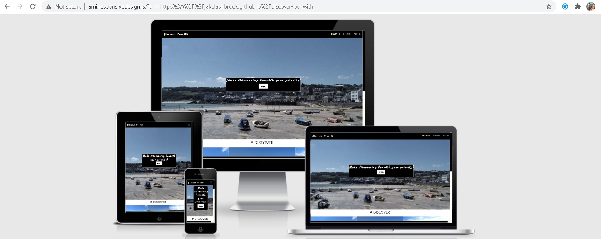

# Discover Penwith - Milestone 2 Project 

See the current [Deployed Version](https://jakelashbrook.github.io/discover-penwith/index.html) of the site.

## Site Summary and Development Plan

This has without a doubt been my most challenging project yet- adding Javascript to my language vocabulary has been
an uphill struggle at points. But once I broke out of Imposter Syndrome mentality, This has without a doubt become my 
most enjoyable project creation yet.

Due to my history working within the Hospitality sector, I naturally gravitate towards creating websites within that
sector because I guess it's become a comfort zone area for me. At first I had decided to create a restaurant/cafe 
website for my employers- and I did! Got to a point of completion- and decided it wasn't enough, it didn't fit with
what I wanted to create for my assessment criteria. So I went back to the drawing board and debated what was pheasable
and what kind of API's I wanted to use. I was actually surfing a facebook group I'm apart of when the idea for 'Discover
Penwith' dawned on me. 

Cornwall has become one of the most popular tourist destinations in the UK, even more so since Staycationing became the
new trend after the Pandemic crisis. Pondering this I decided there wasn't a specific enough guide on Penwith, my area of
Cornwall. For those that don't know what Penwith is- there's two answers! To the English, it's a district of the county
of Cornwall. To the Cornish, it's a county of the forgotten nation of Cornwall. There is simply so much to see and do here, I decided to make a guide to give people ideas of places to visit, things to
do and awesome places to eat. And so, the Discover Penwith site is born.  

To start with it will be a guide, offering links and ideas as an initial MVP site. But long term, I want it to embrace
the local community and become a space for people to interact over local events, suggest things or places to add to the
site content, and help grow the local economy back from the Pandemic and Brexit crisis.

# User Experience (UX)

## User Experience Stories

- First Time User Goals:  
  - a. As a First Time User, I want to be able to easily navigate the site.
  - b. As a First Time User, I want to have access to information on destinations without being drowned in information 
  that I'm not looking for.
  - c. As a First Time User, I want tips or ideas on different places to visit whilst visiting Cornwall.

- Frequent User Goals:  
  - a. As a Frequent User, I want to be able to access the sites Social Media to see if there is any extra 
  information or news available on those channels.
  - b. As a Frequent User, I want to be able to easily navigate to external sources of supporting information.

- Returning User Goals:  
  - a. As a Returning User, I want to be able to get involved with making suggestions for places to visit and
  extra site content.
  

## Design  

- **Typography:**  
The site uses Google Fonts to style the Typorgraphy. The main font used is Open Sans Condensed, with Lato and
Caveat used as secondary fonts. 

- **Logo:**  
The logo is a simple text based one created within the Internet Development Environment using the Google Font Caveat and the
CSS text shadowing effect using the same colours from the websites designated Colour Scheme.

- **Colour Scheme:**  
For the colour scheme I decided to use the colours of the Cornish Flag and the ceromonial colours. The main colours
being black and white- reflecting the flag. And then a sandy/yellow colour for hover effects/links to add a 
distinctive finish to the site.

- **Images:**  
All the images used on the site are either taken by myself, my partner or our local community facebook group with
the permission of the owners for use in this project. There are a lot of images being used on this because when it 
comes to travel a picture really does "speak a thousand words".

- **Site Appearance:**
There is a clear and crisp repetition of colours and structured layout throughout the site so that Users are quickly and 
intuitively used to the sites design.

## Wireframes  

I decided to sketch my wireframes by hand because I'm much more confident with designing them this way- and in all honesty it gives
my eyes some extra screen free time to recover and recoup slightly. You can find links to my original wireframes below:

- **The Discover Penwith Desktop Wireframes:**
[PDF of Desktop Wireframes](/pdf/discover-desktop-wireframes.pdf)  

  Please see the attached PDF for a written summary of the desktop wireframes for this project along with images of the original
  sketches.  

- **The Mobile Wireframe:** 
[PDF of Mobile Wireframe](/pdf/mobile-wireframe.pdf)

  Please see the attached PDF for a written summary and image of the sketched wireframe.  

## Site Evolution Since Wireframe Sketches

Throughout the design process some ideas and factors of the website have changed, for clarity I have decided to write an evaluation 
of the changes made to each page since the initial wireframe design process here. Some aspects of the site such as the Navigation and 
Footer are available across all pages, and are identical in style and functionality. 

- **The Discover Page:**
    The Discover Page is the homepage of the website. It offers a very brief introduction, and features information sections on the 
    three main towns featured on the Discover Penwith site. The Wireframe I originally made for the Discover Page is essentially 
    identical to layout coded. There are no significant changes made that need addressing here.

- **The Explore Page:** 
    The Explore Page is probably the page that has evolved the most since the original wireframe sketch, this is largely due to 
    better ideas forming from further research whilst looking into the Google Development Documentation. Originally, I was going 
    to have button groups for each of the three main towns (St Ives, Hayle and Penzance), and then have 3 categories that would 
    show up after the town buttons are clicked, and then upon clicking one of the 3 categories- markers are dropped on the map 
    within the area of that town. However, after further analysis- i realised that given the site is about the Penwith area as a 
    whole, it would be much more productive to have 3 categories of markers that covered the whole of the Penwith Area. 

    Also, within the original wireframe i planned to have the infowindow content appear below the map once a marker had been clicked on,
    but through the design process i decided i wanted to have a 'Virtual Tour' option for the destinations. This was largely inspired 
    by the lockdowns we've all been experiencing. I thought it would be a nice feature for people to explore and plan trips from the 
    comfort of their homes. To do this, i attached the Street View div to the infowindows/markers so that they could take the tour 
    below the map and get any necessary information from the infowindows on the map at the same time. 

    I also removed the #GET INVOLVED section. Users can use the CTA button in the hero image area to jump to the #JOIN IN page.

- **The Join In Page:**
    The #JOIN IN page has changed a little bit, but it has mainly been done to make way for early planning towards later releases of 
    the website and enhance User Experience and Interaction. The Form Area is exactly the same as the wireframe sketch, except in the 
    first release the form does not allow users to upload documents or media files- this is something that will be added at a later 
    date due to not currently having the available time to process such requests from Users regarding content updates or changes.

    The # NEWSLETTER area has also been scrapped. This is something that was deemed ineffective as their is currently no extra content 
    or news to offer to users. This may be incorporated at a later date if it becomes relevant. Instead, I have a #FEEDBACK section 
    so that users can easily give their thoughts and opinions and help to improve the website by taking part in a survey produced 
    specifically for this purpose. 

    The # SUPPORT section has remained, and mainly focuses on letting users know some of the future plans for the website and giving 
    them a chance to contribute/donate to the running and upkeep of the site via a secure Monzo payment link that opens an external page.

# Technologies Used 

## Languages Used:
- [HTML5](https://developer.mozilla.org/en-US/docs/Web/Guide/HTML/HTML5)  
- [CSS3](https://developer.mozilla.org/en-US/docs/Web/CSS)  
- [Javascript](https://www.javascript.com/)

## Frameworks, Libraries and Programs Used:

1. [Bootstrap 4.5.2](https://getbootstrap.com/docs/4.0/getting-started/introduction/):
    - Bootstrap was used to speedily build the layout of the website and to optimise the responsiveness of the
    website across all devices.  

2. [Google Fonts](https://fonts.google.com/):  
   - The Google Fonts CDN is used to import styled typography to the site using the Open Sans Condensed, Lato and the
   Caveat fonts.

3. [Font Awesome](https://fontawesome.com/):
    - Font Awesome is used to add icons to some of the links used on the site to make them stand out more to users.

4. [Git](https://git-scm.com/):
    - Git is used for version control of the website.

5. [Gitpod](https://www.gitpod.io/):
    - Gitpod was used as the Internet Development Environment for the final draft of the website.

6. [repl.it](https://repl.it/):
    - Repl.it was used during the draft stages of the site creation as it's completely free to use which makes it
    brilliant to use when playing around with different ideas still.

7. [Github](https://github.com/):
    - Github is used to store the committed repositories from Git/Gitpod.  

8. [Google Chrome](https://www.google.com/intl/en_uk/chrome/):
    - Google Chrome was used throughout the Development period, with the Google Chrome Dev Tools 
    environment being crucial to assessing things that need fixing or changing before taking action.

9. [EZGIF.com](https://ezgif.com/):
    - ezgif.com has been used to convert some of the featured images from JPG to WEBP format so that they load faster, 
    and the browser processes the website faster with smaller file sizes to load.  

10. [Minify Code](http://minifycode.com/):  
    - Minify Code has been used to minify the CSS file for optimised website loading, and also to beautify the HTML, CSS 
    and Javascript code so that it's easier to read through.

11. [Am I Responsive?](http://ami.responsivedesign.is/):  
     - Used to provide the screenshot of Discover Penwith across multiple devices at the top of this README.md file.

12. [Responsinator](http://www.responsinator.com/): 
     - Used to check how responsive the site is across multiple device types.  

13. [jQuery](https://jquery.com/):  
     - jQuery is used to speed up the process of writing Javascript code, by offering a much simpler syntax enabling
     the user to write Javascript based code much faster. A large part of the core functionality of the site comes
     from utilising jQuery. The Town Information sections are fully operated using jQuery code. 

14. [Facebook](https://www.facebook.com/):    
     - Facebook has been used to supply the images across this site, the majority from my personal profile and others
     have been sourced from the local facebook group I participate in with consent from the owners.

15. [FormsApp](https://surveyheart.com/form/606849767b70be36e2f9fc54#welcome):
    - I decided to build in an ongoing survey for users to contribute their User Experience Stories to be used for future
    reviews and possible changes to the site based on the suggestions made.

16. [Monzo Payment Links](https://monzo.me/jakelashbrook6):
    - I also decided to add a donation button to the #SUPPORT section because I was intrigued with the monzo payment link technology.
    This is an area I will likely build on in the future development of the app by incorporating Stripe and/or Paypal into the design.
17. [EmailJS API](https://www.emailjs.com/):
    - The EmailJS API is used to power the #JOIN IN form so that a specific email address can receive what's input by the website form 
    users.
18. [Google Maps/Places API](https://developers.google.com/maps/documentation/javascript/overview):
    - The Google Maps/Places API was used to create a map with chosen markers, information and a street view of each selected
    location.

# Testing 

## Validation 

The W3C Markup Validator and The W3C CSS Validator Services were used to validate every 
page of the project to ensure there were no syntax errors in the project:

- [W3 Markup Validator Results - Discover Page](https://validator.w3.org/nu/?doc=https%3A%2F%2Fjakelashbrook.github.io%2Fdiscover-penwith%2Findex.html)  
- [W3 Markup Validator Results - Explore Page](https://validator.w3.org/nu/?doc=https%3A%2F%2Fjakelashbrook.github.io%2Fdiscover-penwith%2Fexplore.html)  
- [W3 Markup Validator Results - Join In Page](https://validator.w3.org/nu/?doc=https%3A%2F%2Fjakelashbrook.github.io%2Fdiscover-penwith%2Fjoin-in.html)  
- [W3C CSS Validator Results - style.css](https://jigsaw.w3.org/css-validator/validator)  
  

- [Esprima Javascript Validator](https://esprima.org/demo/validate.html)
   - The results for main.js said the code is syntactically valid.
   - The results for places.js said the code is syntactically valid.
   - The results for sendEmail.js said the code is syntactically valid.

## Testing User Stories from the UX Section 

- First Time User Goals:  
  - a. As a First Time User, I want to be able to easily navigate the site.
    - When you enter the site, there are clear navigation options across all page.
    - Every page of the site features 'Call To Action' buttons that easily navigate to other areas of the site.
    - Every page features a 'back to the top' button that appears when the page has been scrolled through.
    - The discover page features information areas you can open easily for each town. Each area has a close button floating
    at the top-right side of the page.
  - b. As a First Time User, I want to have access to information on destinations without being drowned in information 
  that I'm not looking for.
    - The town areas are contained within areas that can be easily opened or closed with clear UX friendly buttons.
    - There is a slideshow of destinations to visit on the homepage with easy usability and links for more information.
  - c. As a First Time User, I want tips or ideas on different places to visit whilst visiting Cornwall.
    - There is the slideshow mentioned above with easy suggestions for days out.
    - The #EXPLORE map contains 36 different destinations to visit for users, with links and information available for the selected
    destinations.

- Frequent User Goals:  
  - a. As a Frequent User, I want to be able to access the sites Social Media to see if there is any extra 
  information or news available on those channels.
    - The Social Media Links are available throughout the site within the footer area.
  - b. As a Frequent User, I want to be able to easily navigate to external sources of supporting information.
    - All relevant external resources are linked within the appropriate sections. There are links to the selected 
    locations websites (where applicable) within their generated info links. 
    - There are also links available for transport information to external websites within the selected towns information areas
    on the homepage.
    - All links are targeted as blank to open new windows for users.
- Returning User Goals:  
  - a. As a Returning User, I want to be able to get involved with making suggestions for places to visit and
  extra site content.
    - I've tried to add in multiple ways for users to get involved with the website by creating a whole page # JOIN IN 
    dedicated to fulfulling user engagement with Discover Penwith.
    - The # JOIN IN form prompts users to send a message if they want any destinations adding to the site, any new content or 
    would like to get involved in some other way.
    - The #FEEDBACK section within the #JOIN IN page is especially dedicated to surverying users on their User Experience. This is 
    an ongoing survey taken via an external link with a 3rd party (See Frameworks Credited) organisation. The survey data will be 
    used when analysing future releases and upgrades to the site.
    - The #SUPPORT section is aimed at getting users involved with the long term growth of the site by giving them insight into some 
    of the future design plans. It also enables users to donate to the upkeep and enhancement of the site by offering a payment link 
    powered by Monzo (also listed as a Framework credit).

## UX Survey 

Like my previous project, I decided to incorporate extra facilities for User Experience Testing by using the surveyheart 
app on my # JOIN IN page. Users simply have to click on the button, a new window will open with the survey and users can
leave their thoughts and opinions. The ongoing survey results will be analysed and used for building future enhancements 
and releases of the app after the initial MVP release. 

If you would like to contribute to the UX Survey, you can [click here](https://surveyheart.com/form/606849767b70be36e2f9fc54#welcome).

I plan to add suggested updates from the Survey before each new release of Discover Penwith.

Upon completing the survey users can see a summary of all the questions that have been asked so far, This summary will be 
evaluated before each new release planning starts. Please [take the survey](https://surveyheart.com/form/606849767b70be36e2f9fc54#welcome) if you would like to see an analysis of the results
so far.

## Manual Testing (During Initial Deployment Stages)

To be safe and know for sure my MVP website is ready for an initial release and go to submission for my course with Code Institute, 
I decided to make a log of the processes of manual testing undertaken after the initial deployment in order to assess whether it's 
at an acceptable level to release as an MVP and submit. To begin with, I've started testing on mobile and laptop manually whether all of 
the links, buttons, and images are doing what they're supposed to be. On initial checking- they're all responding how I expected them too.  

**Discover Page Testing:**
1. All links on page checked to make sure that they're functioning correctly. 
2. Check page validation again in at [W3 HTML Validator](https://validator.w3.org/nu/?doc=https%3A%2F%2Fjakelashbrook.github.io%2Fdiscover-penwith%2Findex.html) 
for the 'Discover' homepage.
 - i. Warning given about using the type attribute on the Javascript resource link to the main.js file. 
    - Issue Fix - removed the type attribute from the index.html page. [Issue Fixed](https://validator.w3.org/nu/?doc=https%3A%2F%2Fjakelashbrook.github.io%2Fdiscover-penwith%2Findex.html).
 - ii. Error listed for the function saying 'Attribute function not allowed at this point of the a element'. 
    - Issue Fix - First attempt, moving the function call to the start of the attribute list. This makes no difference whatsoever, so then 
    I tired to change the function attribute to the onclick attribute. This [fixed the issue](https://validator.w3.org/nu/?doc=https%3A%2F%2Fjakelashbrook.github.io%2Fdiscover-penwith%2Findex.html).
3. Checked to see all images are loaded correctly- No issues found.
4. Checked all buttons are functioning correctly- No issues found.
5. HTML sections need to be distinguished for SEO- Section and Main tags added to index.html.

**Explore Page Testing:** 
1. All links on the #EXPLORE page have been tested and are working. 
2. The map has been tested and is working but with 2 slight glitches:
 - i. The map doesn't automatically load until one of the buttons that generates the different markers on the map is clicked.  
    - Upon first inspection of the code for the map, I have noticed that I have not added the polyfill CDN link for the map, so my 
    first resolution attempt will be to add this back into the code. This did not appear to change anything! So then i checked the
    link and realised i had removed the callback for the initMap function, this has now been replaced and the map is loading again 
    with the rest of the page content.
 - ii. The info windows generate on the map as expected, however when a new info-window is clicked the previous one does not close
 as was expected. This is a problem within the codebase that needs to be carefully fixed to enhance the overall User Experience.
    - Although I wrote code to close the open InfoWindow when a new one is opened, the code is faulty and isn't functioning correctly.
    I have tried a few different ways to fix this, and currently haven't been able to find a solution, however the site is still fully
    functional- it's just annoying having to individually close each InfoWindow to stop them overlapping. A fix is on the way!
3. As expected, the Street View of each marker selected is generated upon a new marker being clicked. There are no problems with 
this feature. However, I plan to keep an eye on the street view locations to see if they can be updated if/when Google updates the 
locations which offer a Street View.
4. All images displayed correctly.
5. The last thing that caught my attention was that when the # TOUR section appears with the Street View the section blends with the 
footer- this has been resolved with a simple white inline style rule of a white border-top being added to the footer element on the 
explore page. 
6. HTML Sections need to be distinguished for SEO- section and main tags Added to explore.html page.
7. Throughout the design process I've been trying to modify my Javascript code so that the info windows close when another is clicked,
I have not worked out a solution to this so far- but have made it the number 1 priority for the second release.

**Join In Page Testing:**
1. All links on the #JOIN IN page working correctly.
2. The form on the #JOIN IN page is functioning correctly after manual testing- responses received from site testers also. 
3. All Images display correctly on the page and on the map info-windows.
4. All buttons function correctly. 
5. HTML Section need to be distinguished for SEO- Section and Main tags Added to HTML code.

## Lighthouse Site Testing 
This testing is relevant at the time of the testing being executed and was carried out after the manual site testing that has been 
listed above. Lighthouse breaks the testing into 4 categories: Performance, Accessibility, Best Practices, and SEO. I will use the 
test results to try and improve the websites functionality and to improve the speed at which it loads the content of the site.

### Mobile and Desktop Testing On Lighthouse:
The initial mobile testing after deployment was carried out on 05/04/2021. All test results for Desktop came back as over 90%,
so I'm happy with the Desktop Lighthouse Testing. Please see below the scores given for mobile testing and some of the resolutions
used so far.

**Performance**  
Suggestions to improve the performance:  
- Eliminate render blocking resources. 
    - So this means I need to make sure i defer any resources being called on before the first paint of the website, aswell as remove 
    any unneccesary external links, resources or frameworks. The only option I have here is to check all links that can be deferred 
    until the page has been loaded have been.  All available links have been deffered.
- Serve static assets with an efficient cache policy. 
    - Currently I'm not advanced in my knowledge enough to know how to change this, 
so I have read the information provided by Lighthouse and will attach the [documentation](https://web.dev/uses-long-cache-ttl/?utm_source=lighthouse&utm_medium=devtools) 
to address in a later release of the website.
- Amp-Img tags for images used in Javascript generated areas.
    - To help improve page performance I have changed all IMG tags within the town information areas to AMP-IMG tags. These areas are
    only available to Javascript enabled devices.

The page with that needs the most long term attention is the #EXPLORE page for mobile devices, with the performance score ranking at 
around 54/100. Lighthouse lists the following suggestions and warnings for improving the performance here: 
    - Uncaught Reference Error: google is not defined. Errors are within the places.js file at line 280 and 330! I have tried to make 
    sure all variables are listed properly. I've also removed the function callback from the Google Maps API link, and researched 
    the reference Error. For now, I've done everything I can to fix the issue with the knowledge I have. However, I aim to come back 
    and fix this more thoroughly before the second release. From further testing, I have improved the performance score to 84/100. I'm 
    happy with this result for now.

**Accessibility**  

This is the highest possible score that can be achieved for this category of testing- so I'm sufficiently happy with this area of testing.

**Best Practices**  

This is a very high score for Best Practices, so i'm extremely happy with this. However, lets have a look at what could be improved: 
- Links to cross-origin destinations are unsafe. 
    - So this is a pretty easy fix, to improve the security of the site I just need to make sure the all exterior links are using the
    'rel:noopener' or 'rel:noreferrer' to improve performance and prevent security vulnerabilities. This has been added to all links 
    with an external source.

**SEO Score**  
Again, this a very high score that I'm extremely happy with- however let's take a look at what we can do to improve it:
- Document does not have META description.  
    - This is an easy fix, it just needs each page to have a meta description added. For more information on this,
    [click here](https://web.dev/meta-description/?utm_source=lighthouse&utm_medium=devtools). Meta descriptions added to pages.
- Structured Data is Valid.
    - Google Lighthouse offers the [Structured Data Testing Tool](https://search.google.com/structured-data/testing-tool/u/0/) 
    and the [Structured Data Linter](http://linter.structured-data.org/) to validate Structured Data. I will use these Tools 
    to help improve the overall SEO score where possible for this site. The website passed the Structured Data Testing Tool with 
    no warnings or errors. The same results were given from the Structured Data Linter.
  

# Deployment 

## GitHub Pages  

I deployed the project to GitHub Pages directly from my repository settings. You can deploy for yourself following these steps:  

1. Go to your [GitHub Account](https://github.com/) and sign in to your account.
2. Find the [Discover Penwith](https://github.com/jakelashbrook/discover-penwith) repository.
3. At the top of your repository, you should see a navigation explicitly for your repository starting with Code and ending with Settings. 
Click on the "Settings" button on this menu.
4. Scroll down the Settings Page until you reach the GitHub Pages Area.
5.  Click on the dropdown that shows 'None' selected by default, and click on the 'Master' branch option. Click Save.
6. The page automatically refreshes upon saving the Master branch, scroll back down to the GitHub Pages area.
7. Here you will locate the [link](https://jakelashbrook.github.io/discover-penwith/index.html) to the newly deployed site on GitHub Pages. 

To find out some more about GitHub Pages you can [click here](https://pages.github.com/).

## Forking the repository

You can fork the repository to make a copy of the original repository where you can make edits or changes to the files without affecting
the original repository version. If you would like to fork the repository, follow these instructions:

1. Login to your [GitHub Account](https://github.com/).
2. Locate the [Discover Penwith](https://github.com/jakelashbrook/discover-penwith) repository.
3. At the top of the repository (using the repository navigation bar, not the site navigation) just above the "Settings" button you 
can locate the "Fork" button.
4. Hit the "Fork" button.
5. You should now have a copy of the [Discover Penwith repository](https://github.com/jakelashbrook/discover-penwith) in your
personal GitHub Account repositories.

To find out more about forking a repository on GitHub, you can [click here](https://docs.github.com/en/github/getting-started-with-github/fork-a-repo).

## Making a Local Clone 

To make a local clone, follow these instructions:  

1. Login to your [GitHub Account](https://github.com/).
2. Locate the [Discover Penwith repository](https://github.com/jakelashbrook/discover-penwith).
3. To clone the repository using HTTPS, underneath "Clone with HTTPS", copy the link.
4.  Type `git clone` and then paste the HTTPS code you copied ealier.  

    For example:  

    `$ git clone https://github.com/YOUR-USERNAME/YOUR-REPOSITORY`
5. Lastly, Press Enter and your local clone should be created for you.

If you would like to read some more about creating local clones, you can [click here](https://docs.github.com/en/github/creating-cloning-and-archiving-repositories/cloning-a-repository).

# Credits 

## Code
- [Bootstrap](https://getbootstrap.com/): 
A big credit to bootstrap for enabling me to build faster using it's framework components/rules and then using personalised CSS rules to edit and restyle 
the website.

- [W3C Schools](https://www.w3schools.com/howto/tryit.asp?filename=tryhow_js_scroll_to_top):
This guide to make a 'Back to the top' button was used build my back to the top button.

- [Code Institute](https://codeinstitute.net/): For all the lessons i've learnt so far to enable me to code to this level.

- [Google Developer Docs](https://developers.google.com/maps/documentation/javascript/overview): All of the Google API Documentation 
for helping me learn to use the API's and create ideas for better concepts within my app by also including a street view of my markers
which wasn't part of my original plan for the site. 

## Content 
Most of the pictures and written content are my own. However, some photographs are provided from friends and family members. All of the 
towns information on the homepage is from Wikipedia. All of the photos used within the Info Windows on the map are externally sourced, 
all written information on the info windows is typed myself. You can view the PDF document I made whilst planning the Info Window content
[here](/pdf/info-window-planning.pdf) to see a library of the written content and external image links used.

## Media
The only external media files used are the ones within the Info Windows generated on the map when a marker is selected. You can 
find a list of the external links used [here](/pdf/info-window-planning.pdf). Some other images from external sources have been used
with consent for this specific project.

## Acknowledgements 

- My local community group for helping me with missing content and forming strong opinions for what should be in the initial version 
release.
- Antonio Rodriguez, my mentor. For always being on hand to help me.
- My partner, for continuing to push and motivate me.
- The Code Institute Team and fellow students for helping me take this journey.
- The Penwith Area, for inspiring me with its beauty.

